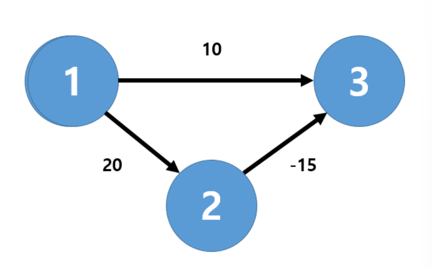
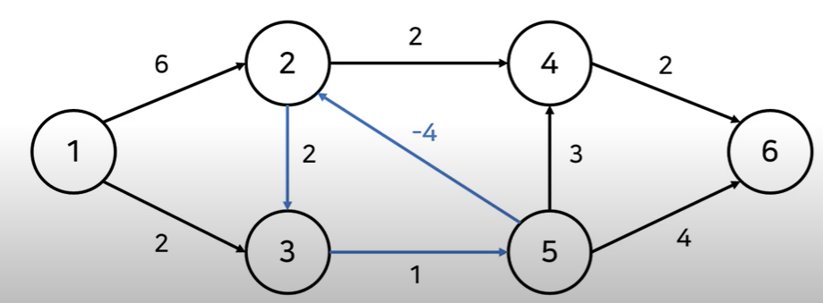

# 벨만-포드 알고리즘

- 한 노드에서 다른 노드까지의 최단 거리를 구하는 알고리즘

- 간선의 가중치가 음수일 때도 최단거리를 구할 수 있음

# 다익스트라 vs 벨만-포드

### 1번 노드에서 3번 노드로 가는 가장 최단 거리

#### 경우의 수 - 2가지

- 1-> 3 (cost: 10)
- 1 -> 2-> 3 (cost: 20 - 15 = 5)

#### 다익스트라 알고리즘을 사용하면?

- 매번 방문하지 않은 노드 중에서 최단 거리가 가장 짧은 노드를 선택
- 1 -> 3 (cost: 10)의 경로를 선택
- 이처럼 음수 간선이 존재하면 최단 거리를 찾을 수 없는 상황이 발생
- 시간 복잡도가 빠름(OElogV) --> 개선된 다익스트라 알고리즘 (우선순위 큐 사용)

#### 벨만-포드 알고리즘을 사용하면

- 매번 모든 간선을 전부 확인 
  - 1번 -> 2번 -> 3번(cost: 20-15 = 5)의 경로를 선택하여 최단 거리 찾을 수 있음
- 음수 간선이 있어도 최적의 해 찾을 수 있음
- 시간 복잡도가 느림 O(VE)

모든 간선의 비용이 양수일 때는 다익스트라를, 음수 간선이 포함되어 있으면 벨만-포드를 사용하면 됨

## 벨만-포드 알고리즘 수행과정

1. 출발 노드 설정
2. 최단 거리 테이블 초기화
3. 다음의 과정을 (V(=정점)-1)번 반복
   1. 모든 간선 E개를 하나씩 확인
   2. 각 간선을 거쳐 다른 노드로 가는 비용 계산 -> 최단 거리 테이블 갱신
4. 만약 음수 간선 순환이 발생하는지 체크하고 싶다면 3번 과정을 한번 더 수행
   -> 이때 최단 거리 테이블이 갱신된다면 음수 간선 순환이 존재한다는 의미

## 음수 간선 순환을 왜 확인하는지?

- 2번 -> 5번 으로 가는 순환이 있기 때문에 비용을 -1 로 단정지을 수 없음
    - 순환을 계속 돌게되면 2번 -> 5번으로 가는 비용을 무한히 줄일 수 있음

이렇게 되면 최단 거리를 구할 수 없기 때문에 
음수 간선 순환을 확인해줘야함.

V-1까지 모든 단계를 진행한 후, 다음 단계인 V번째 단계일 때도 최단 거리 테이블이 
갱신된다면 최단 거리를 무한히 줄일려는 시도이므로 
음수 간선 순환이 존재한다는 사실을 알 수 있음

따라서 V번째 단계에서 최단 거리 테이블 갱신 여부로 음수 간선 순환을 확인할 수 있음

즉, V-1까지 단계를 진행하면 모든 노드에 대한 최단 거리가 확정됨.

